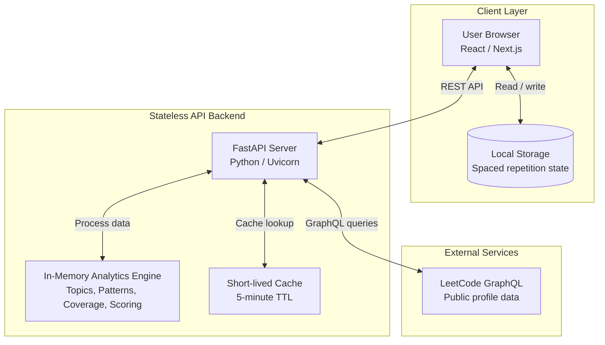
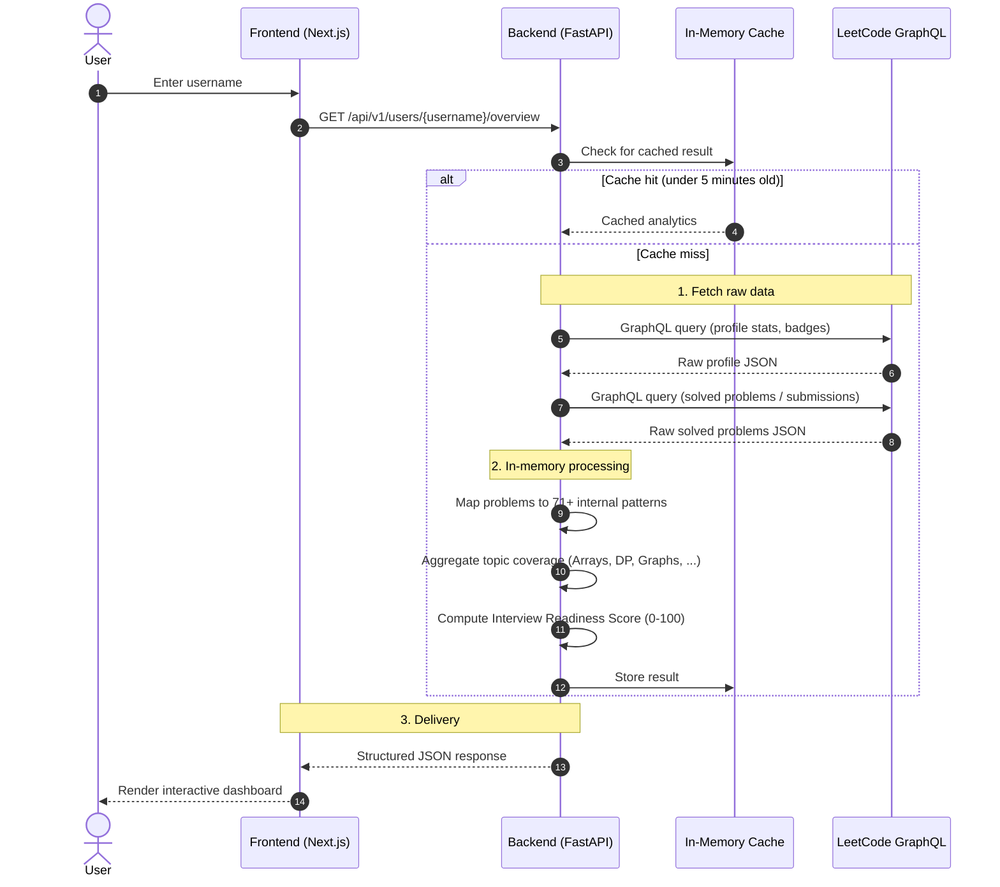
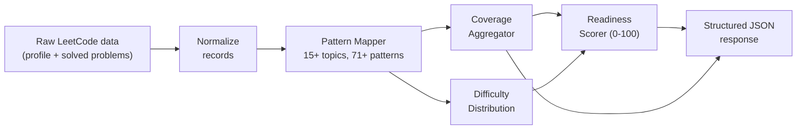

<div align="center">

# LeetLens 🔍

**Understand your DSA patterns, identify blind spots, and master interviews.**

An open-source, stateless analytics platform and spaced repetition companion for LeetCode.


</div>

---

## Table of Contents

1. [Overview](#overview)
2. [Key Features](#key-features)
3. [Architecture](#architecture)
4. [Data Flow](#data-flow)
5. [Analytics Pipeline](#analytics-pipeline)
6. [Tech Stack](#tech-stack)
7. [Getting Started](#getting-started)
8. [Design Decisions](#design-decisions)
9. [Legal Disclaimer](#legal-disclaimer)

---

## Overview

LeetLens turns a raw LeetCode submission history into actionable insight. Enter any LeetCode username and the app generates a complete dashboard that:

- Categorizes solved problems into strict DSA topics and patterns
- Scores your interview readiness
- Shows a timeline of your learning journey
- Schedules pattern reviews so you practice right before you forget

---

## Key Features

| Feature | Description |
|---|---|
| **Stateless & Private** | No database. All analytics are computed in memory from LeetCode's public GraphQL API. Your data is never stored on our servers. |
| **Taxonomy Explorer** | Problems are mapped against 15+ core topics and 71+ high-frequency interview patterns. |
| **Spaced Repetition Hub** | Review intervals are tracked in the browser's local storage, so you revisit patterns at the right moment. |
| **Interview Readiness Score** | A proprietary 0–100 score combining four weighted pillars: Topic Breadth (30%), Difficulty Depth (30%), Pattern Mastery (25%), and Streak/Velocity Consistency (15%). |

> [!NOTE]
> **Data Limit & Local History:** The live sync is based solely on your **20 to 40 most recent submissions**. However, LeetLens accumulates your confirmed solved problems in your browser's `localStorage` across visits. Manual imports are stored as unverified. These stored problems are sent to the backend for enrichment (keyed per history hash) providing full analytics over time without requiring authentication.

---

## Architecture

LeetLens separates concerns across three layers: a lightweight client, a stateless API backend that does the heavy processing, and LeetCode's public GraphQL API as the only data source.



**Layer responsibilities**

| Layer | Responsibility |
|---|---|
| **Client** | Renders the dashboard and manages spaced repetition schedules locally. |
| **Backend** | Fetches data on demand, maps problems to patterns, computes scores, and returns clean JSON. |
| **External** | LeetCode's public GraphQL API, the single source of truth for profile and submission data. |

---

## Data Flow

The sequence below shows the full lifecycle of a dashboard request, from entering a username to rendering results.



### Example response shape

The structure below is **illustrative** only. Field names and values are examples, not the exact API contract.

```jsonc
{
  "username": "example_user",
  "readiness_score": 72,
  "solved": { "easy": 120, "medium": 210, "hard": 35 },
  "topics": [
    { "name": "Dynamic Programming", "solved": 48, "coverage": 0.64 }
  ],
  "patterns": [
    { "name": "Sliding Window", "solved": 14, "status": "strong" }
  ],
  "blind_spots": ["Union Find", "Monotonic Stack"]
}
```

---

## Analytics Pipeline

Inside the backend, raw LeetCode data passes through a short in-memory pipeline before it is returned to the client.



The readiness score is built from three inputs: **total problems solved**, **difficulty distribution**, and **unique patterns covered**.

---

## Tech Stack

| Area | Technology | Why |
|---|---|---|
| Frontend | **Next.js**, **TailwindCSS** | Server-side rendering, built-in routing, optimized production builds, and fast component-based UI. |
| Backend | **FastAPI**, **Uvicorn** | High-performance asynchronous endpoints, ideal for ingesting and aggregating hundreds of problem records. Python is well suited to data processing. |
| Data source | **LeetCode GraphQL API** | Public profile data, fetched fresh on every request. |
| Persistence | **None** | Eliminates stale data, hosting cost, and privacy risk. |

---

## Getting Started

No databases or Docker containers are required. You only need the source files.

### Prerequisites

- Python 3.x
- Node.js and npm

### 1. Backend (FastAPI)

```bash
cd backend
python -m venv venv

# Activate the virtual environment
venv\Scripts\activate          # Windows
# source venv/bin/activate     # macOS / Linux

pip install -r requirements.txt
python -m uvicorn app.main:app --host 127.0.0.1 --port 8000 --reload
```

The API will be available at `http://127.0.0.1:8000`.

### 2. Frontend (Next.js)

```bash
cd frontend
npm install
npm run dev
```

Open [http://localhost:3000](http://localhost:3000) in your browser.

---

## Design Decisions

**Why zero database?**
Storing user data introduces sync complexity and stale records. Fetching fresh from LeetCode on each request, with a short 5-minute in-memory cache, keeps data accurate. It also guarantees user privacy and removes database hosting costs.

**Why on-demand fetching?**
LeetCode is only queried when a user requests a dashboard. This avoids polling for inactive users and greatly reduces the risk of hitting API rate limits.

**Why aggregate on the backend?**
Pattern matching and scoring run in Python on the server. This keeps the React client lightweight and responsive, even on slow mobile devices.

**Why local storage for spaced repetition?**
Review schedules are personal and small. Keeping them in the browser preserves the stateless, private design of the platform.

---

## Legal Disclaimer

**LeetLens is an independent, open-source project and is not affiliated with, endorsed by, or sponsored by LeetCode LLC.**

- All LeetCode trademarks, service marks, problem names, and logos belong to **LeetCode LLC** and their respective owners.
- LeetLens queries public profile submission statistics solely for personal educational and self-improvement purposes.
- LeetLens does **not** host, scrape, reproduce, or redistribute LeetCode's copyrighted problem descriptions, test cases, official solutions, or Premium-exclusive content. All problem links direct back to LeetCode.com.
